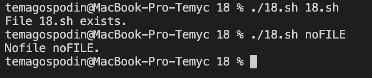

# Task 1

## Script 01
Mission: "Hello World!".

The result of the script:


## Script 02
Mission: Вывести:
+ Текст с переносом строки;
+ Текст без переноса строки.

Для второго случая использовать `echo` с необходимым параметром. Для просмотра доступных параметров можно воспользоваться командой `help echo`.

The result of the script:


## Script 03
Mission: Написать скрипт, включающий в себя:
+ Однострочный комментарий;
+ Многострочный комментарий.

Подсказка: для второго случая использовать следующую конструкцию комментария:
```
: '
line text 1
line text 2
line text ...
'
```
Вывести после каждого комментария результат каких-либо вычислений:
```
((res=4+5))
echo $res
```

The result of the script:


## Script 04
Mission: Вывести последовательность чисел от 1 до 10 с использованием цикла `while`.

The result of the script:


## Script 05
Mission: Вывести в одну строчку через пробел последовательность чисел от 10 до 1 с использованием цикла `for` и декремента. После завершения работы цикла добавить перенос строки.

The result of the script:


## Script 06
Mission: Получить имя пользователя с помощью команды `read` и вывести приветствие.

The result of the script:


## Script 07
Mission: Используя условный оператор `if` выполнить проверку на количество введенных пользовтелем символов. Если пользователь не ввел ни одного символа - вывести соответсвующее сообщение, иначе - вывести пользовательское сообщение.

The result of the script:


## Script 08
Mission: Реализовать "форму авторизации". Запросить с помощью `read` "логин" и "пароль". В случае ввода определенной комбинации (например `admin:123456`) вывести сообщение об успехе, иначе - сообщение об ошибке. Использовать оператор `&&`.

The result of the script:


## Script 09
Mission: Реализовать скрипт, определяющий принадлежность введенного пользователем слова к названию времен года (*winter, spring, summer, autumn*). Использовать условный оператор `||`. Если введено время года - вывести "Correct!", иначе - "Incorrect!".

The result of the script:


## Script 10
Mission: Доработать скрипт **09.sh**, добавив отдельный вывод для одного из корректных вариантов ввода. Использовать оператор `elif`.

The result of the script:


## Script 11
Mission: Доработать скрипт **10.sh**, использовав оператор `case`.

The result of the script:


## Script 12
Mission: Реализовать скрипт, принимающий и выводящий в одну строчку 2 аргумента. На второй строчке вывести количество переданных аргументов (используя конструкцию языка для подсчета).

The result of the script:


## Script 13
Mission: Реализовать скрипт, выводящий таблицу умножения на 2. Использовать цикл `for` или `while`.

The result of the script:


## Script 14
Mission: Реализовать скрипт, рассчитывающий сумму введенных чисел, реализовав функцию `function Sum()` и вызвав ее. Ввод слагаемых считывать с помощью `read`.

The result of the script:


## Script 15
Mission: Реализовать скрипт, ожидающий ввод числа и определяющий принадлежность этого числа к множеству четных/нечетных чисел.

The result of the script:


## Script 16
Mission: Реализовать скрипт, выводящий "шапку" таблицы процессов и последний процесс в приведенном ниже формате. Использовать по отдельности команды `head` и `tail` с необходимыми аргументами.

The result of the script:


## Script 17
Mission: Реализовать скрипт, возвращающий количество доступных процессоров. Использовать информацию из `/proc/cpuinfo`.

The result of the script:


## Script 18
Mission: Реализовать скрипт, проверяющий наличие файла. Путь до файла передавать первым аргументом при вызове.

The result of the script:


## Script 19
Mission: Реализовать скрипт, принимающий первым аргументом название файла; создающий его; выводящий листинг по названию файла; удаляющий файл; повторно выводящий листинг. Использовать команды `touch`, `ls`, `rm`.

The result of the script:


## Script 20
Mission: Реализовать скрипт, создающий папку. В случае, если папка уже существует, вывести сообщение об этом и закончить выполнение. Название папки получить через `read`.

The result of the script:


## Script 21
Mission: Реализовать скрипт, вычитывающий содержимое файла line-by-line. Путь до файла передать первым аргументом при вызове. Использовать конструкцию `while read line; do`.

The result of the script:


## Script 22
Mission: Реализовать скрипт, выводящий случайное число. Правую границу диапазона передать первым аргументом при вызове.

The result of the script:


## Script 23
Mission: Реализовать скрипт, выводящий дату запуска и дату завершения его работы. Между двумя выводами использовать `sleep`. Количество секунд передать в первом аргументе при запуске.

The result of the script:


## Script 24
Mission: Реализовать скрипт, выводящий "раскрашенный" первый аргумент.

The result of the script:


## Script 25
Mission: Реализовать скрипт, определяющий размер директории (`du`). Отобразить вывод в human-readable формате. Путь до целевой директории передать первым аргументом.

The result of the script:


## Script 26
Mission: Реализовать скрипт, инициирующий 2 процесса (например, `sleep 1 &`), и завершающийся после завершения последнего из процессов (`wait`).

The result of the script:


## Script 27
Mission: Реализовать скрипт, конвертирующий Unix time в human-readable дату. Исходное значение Unix time передавать первым аргументом.

The result of the script:


## Script 28
Mission: Реализовать скрипт создания временной директории. Использовать механизмы ОС.

The result of the script:


## Script 29
Mission: Реализовать скрипт, выводящий количество символов в самой длинной строке файла. Путь до исходного файла передавать первым аргументом.

The result of the script:


## Script 30
Mission: Реализовать скрипт, возвращающий дату последнего изменения файла. Путь до исходного файла передавать первым аргументом.

The result of the script:


___
P.s. [The problem condition is taken from here.](https://github.com/rtu-os/ktso-0x-20/tree/main/task01)